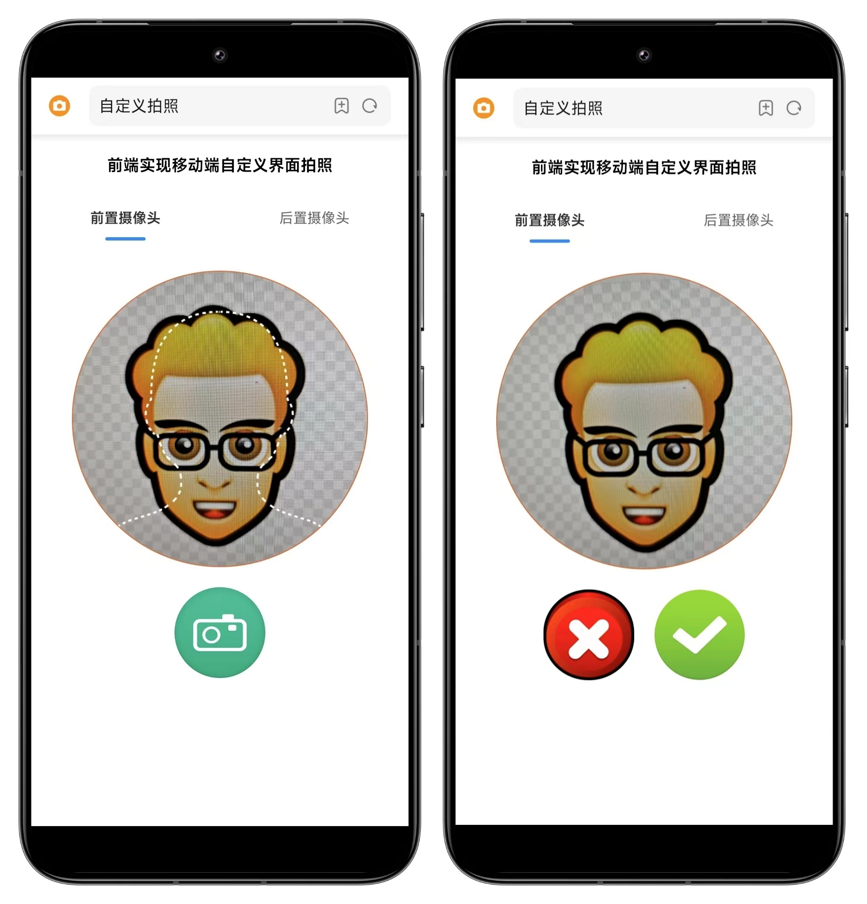
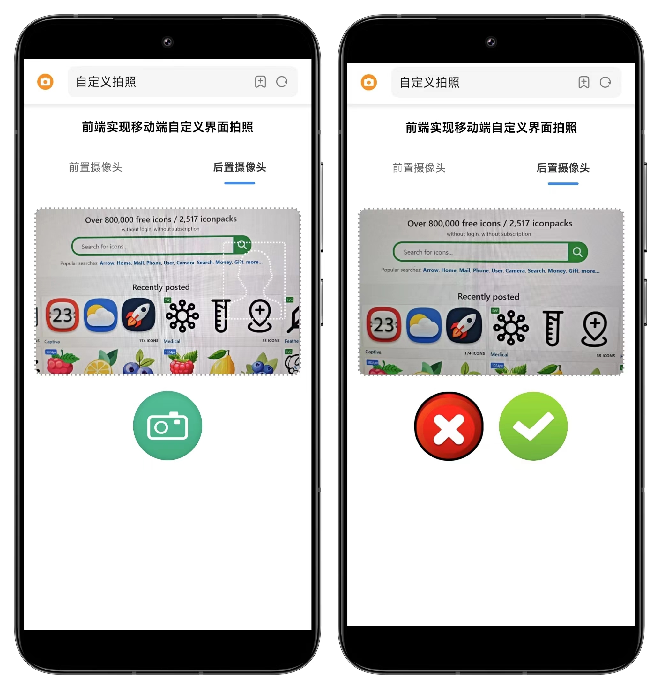

# 前端实现移动端自定义界面拍照demo

## 技术栈 
1.vite+vue3+vant  
2.使用rem适配移动端（postcss-pxtorem插件，amfe-flexible插件） 

## 实现思路 
1.使用MediaDevices.getUserMedia()获取摄像头视频流，通过video标签渲染  
2.使用canvas标签绘制图片实现拍照 然后使用canvas.toDataURL()方法将图片转为base64格式  

## 运行项目
安装依赖：npm install  or pnpm install  
启动项目：npm run dev or pnpm run dev  

## 预览
  
  

## 注意事项
需要用户授权打开摄像头  
需要开启https 代码里面使用了插件 vite-plugin-mkcert在本地开启https